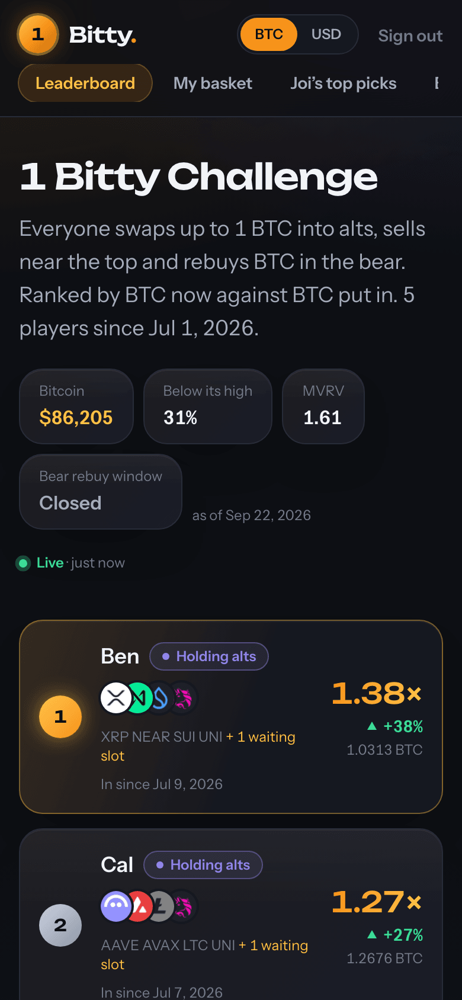
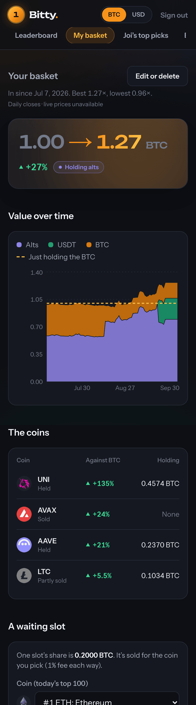
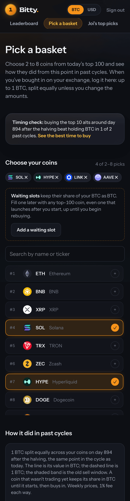
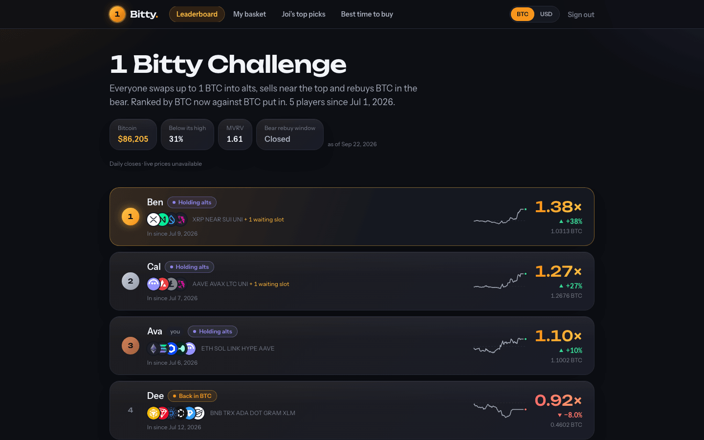

# Rotation: the 1 Bitty Challenge

A small, mobile-first web app for a private group game: everyone swaps up to 1 BTC into a basket
of alts, sells near the top and rebuys BTC in the bear, and is scored in BTC, so the question is
simply who ends with the most. A Python engine refreshes market prices every day, a Postgres
database with row level security keeps what each person holds, and the app values every basket on
request.

<p>
  
  
  
</p>



More: [basket (desktop)](docs/screenshots/entry-desktop.png),
[picker (desktop)](docs/screenshots/pick-desktop.png),
[Joi's top picks](docs/screenshots/picks-mobile.png),
[best time to buy](docs/screenshots/timing-mobile.png),
[admin](docs/screenshots/admin-desktop.png), [sign in](docs/screenshots/login-mobile.png).
The screenshots show the local demo data, not real people.

Built with AI coding agents working under the rules in [AGENTS.md](AGENTS.md); every change passes
the checks described below before it is pushed.

Live app: https://rotation-web-seven.vercel.app. It is members only: an admin approves each
sign-up, so you will see the sign-in page.

## How it works

**The challenge.** Each member puts up to 1 BTC into a basket of 2 to 8 coins, each one in the
top 100 on the day they buy in, split equally unless they change the amounts. Some picks can be
waiting slots: that share stays in BTC and is filled later with any top-100 coin, until rebuying
starts. They hold through the bull run, sell the alts for USDT near the top and rebuy BTC in the
bear. The score is BTC out divided by BTC in, and a challenge ends when every entry is back in
BTC. The app never trades and never says when to: people place their own trades on their own
exchange and log them here. Sells, rebuys and every buy-in are recorded against USDT, and the
database refuses a trade that breaks a rule (more than 1 BTC in, selling more than you hold, a fill
that is not exactly one slot's share).

**The daily pipeline.** A GitHub Actions job runs once a day at 13:15 UTC.

```
GitHub Actions (daily)
   |
   |-- engine: `rotation daily` --> CoinMetrics (BTC price, MVRV) + CoinGecko (top 250 coins)
   |                                   |
   |                                   v
   |                        Supabase Postgres (market_state, daily_prices) <--- RLS ---+
   |                                                                                   |
   `-- POST /api/jobs/daily --> Next.js app on Vercel: values every entry  <--- people sign in
                                   |
                                   v
                         Discord webhook: who bought in, sold, rebought, Sunday standings
```

The engine never reads anyone's trades and the app never writes market data; they meet only in
the database. Discord gets names, coins and BTC multiples, never amounts.

## Features

- Leaderboard ranked by BTC now against BTC put in, with sparklines, a phase badge for each person
  (holding alts, holding USDT, back in BTC) and a one-tap switch between BTC and USD
- Live prices from CoinGecko that fall back to the last daily closes when the call fails
- Your basket: a value-over-time chart of alts, USDT and BTC against "just holding the BTC", and a
  table of every coin
- A basket picker over today's top 100 coins that previews how the same basket did from this point
  in the last two cycles, with waiting slots
- Logging sells and rebuys, filling a waiting slot, editing or deleting a basket
- "Joi's top picks": five baskets that did best in past cycles, and why
- "Best time to buy": how buying alts went by point in the four-year cycle, with a verdict for today
- Sign-up with Google or email and password, approved by an admin; a forgotten password is fixed
  with a one-time sign-in link the admin makes
- An admin People page: approve, reject, remove, help links, each recorded in an audit table by id
- Discord posts for buy-ins, sells, rebuys, the rebuy window opening and Sunday standings, sent once
  each
- Dark only, and checked with axe for accessibility

## Research

The challenge rules came from backtests on the two cycles the alt data covers, run in
`engine/src/rotation/backtest/` with generated reports in [docs/backtests/](docs/backtests/). They
are written to say what did not work too.

- Buying alts late in a cycle lost BTC. In 2022 to 2025 every basket tested finished at about 0.5
  to 0.8 BTC per BTC at the old sell window.
- Baskets picked with hindsight made 4 to 5 times in 2018 to 2021, but the top 5 or 10 coins
  picked at the time lost BTC in 5 of 6 cases.
- No "sell the alts now" trend alert beat selling on the halving clock, so the app has none. It
  shows the old sell window as a reference date.
- Most of the extra BTC came from the rebuy: selling near the top and rebuying in the bear
  multiplied every 2018 basket by about 2.5 times, and so did holding 1 BTC with no alts.
- Buying alts from about a year before a halving to nine months after did best; buying after the
  top did worst. The 2024 cycle had no alt season. Three cycles is a small sample.
- An earlier rule-based strategy lost BTC and a BTC cycle harvest beat holding; both were archived
  ([ADR-004](docs/decisions/ADR-004-archive-cycle-harvest-engine.md)) when the app became only this
  challenge.

## Tech stack

Next.js 16 (App Router, Server Components, Server Actions), React 19, TypeScript (strict),
Tailwind CSS v4, Recharts, Supabase (Postgres, Auth, RLS), Zod, Vitest, Playwright with axe,
ESLint and dependency-cruiser, npm. The engine is Python 3.12 with uv, pandas, Typer, pytest, ruff
and mypy. Deployed on Vercel, scheduled with GitHub Actions.

## Architecture

Code in `web/src` depends in one direction, `app -> features -> data -> domain -> lib`, plus `ui`
and `integrations`, enforced by ESLint and dependency-cruiser.

```
            app            routes: check access, call one feature, render
           /   \
    features    ui         vertical slices; presentational components
     /   |   \    \
 data  integrations  \     repositories; one adapter per vendor (CoinGecko, Discord)
     \   /            \
     domain            |   pure rules: valuation, standings, buy-in plan, waiting slots
        |              |
       lib  <----------+   dates, formatting, ApplicationResult, logger, security headers
```

Every request that reaches data follows one chain, and the database has the last word:

```
route / Server Action  ->  service (feature)  ->  repository (data)  ->  Supabase (RLS)
  transport and auth        the use case           builds the query       final authority
```

The fairness rules (1 BTC cap, basket size, no overselling, slot shares) are enforced in the
database and mirrored in `domain` so a person gets a message they can act on. Valuation is a pure
function of trades and daily closes. Each `web/src` folder has a short README with what belongs
there and what it may import.

See [docs/architecture.md](docs/architecture.md) and the [decision records](docs/decisions/).

## Engineering practices

What a tool enforces, not what the team promises:

- **The gate.** `node scripts/check.mjs` runs web lint, format, types, the import graph, guards,
  unit tests and the production build, then engine lint, format, mypy and pytest, then the
  database tests. The pre-push hook runs it, and a `commit-msg` hook checks the subject format.
  A push to `main` deploys to production, so the gate is before the push.
- **Layer rules.** ESLint import restrictions and dependency-cruiser rules: routes never import
  data or integrations, only features import integrations, domain and lib import no framework,
  no cycles, no orphans. A lint rule refuses literal colors, and `process.env` outside one file.
- **Guards.** Kebab-case file names and `.env.example` matching the validated environment are
  checked on every run.
- **Database.** Row level security on every table, checked against the catalog by a pgTAP test, and
  allow and deny tests for every write and admin function. CI also fails if the generated database
  types are stale.
- **Browser tests.** Playwright on a desktop and a phone profile, axe at WCAG 2.2 AA (serious and
  critical fail), a spec for the security headers and content security policy, and a signed-in
  journey (sign up, wait, approval, help link, rejection, audit trail) against a local Supabase.
- **Security.** A nonce-based content security policy set per request, HSTS, frame and referrer
  headers, gitleaks over the full history and `npm audit` and `pip-audit` on every push and weekly.
- **After a deploy.** A workflow waits for `/api/health` to report the pushed commit, then runs
  the browser suite against production.
- **Honesty.** Known gaps are in [docs/exceptions.md](docs/exceptions.md), each with a reason and an
  expiry. [docs/enforcement-matrix.md](docs/enforcement-matrix.md) lists every rule and whether a
  tool, a reviewer or nothing checks it. [Runbooks](docs/runbooks/) cover rollback, restore,
  credential rotation, adding players and kill switches; they have not been exercised yet.

Measured on 2026-09-30: 250 web unit tests, 46 engine tests (1 skipped without the research
cache), 74 database tests, 38 signed-out browser runs and 9 signed-in.

Not done, on purpose or not yet: BTC amounts are JavaScript floats rather than integer sats, the UI
is hand-built from design tokens rather than a component kit, logs have no correlation ID or
alerting, and there is no backup of members' data on the free database plan. Each is an open
exception.

## Local setup

Requires Node 22, [uv](https://docs.astral.sh/uv/) and Docker.

```sh
git config core.hooksPath .githooks
supabase start                # local Postgres and Auth, every migration applied
supabase db reset             # loads supabase/seed.sql, the demo challenge
cd web && npm install
cp .env.example .env.development.local   # fill in the URL and keys from `supabase status -o env`
npm run dev
```

Open http://localhost:3000 and sign in with a demo account. Every demo account is
`<name>@example.test` with the local-only password `rotation-demo-2026`:

| Name | Role |
| --- | --- |
| Ava, Ben, Cal, Dee, Eli | Members with baskets, a waiting slot, sells and one rebuy |
| Sam | Admin (opens the People page) |
| Fay | A sign-up waiting for approval |

The seed is generated by `supabase/seed/build_seed.py` from the engine's cached public prices and
contains no real people. It is for the local stack only; never load it anywhere else. The engine
(`cd engine && uv sync && uv run pytest`) needs no keys to test. The screenshots in `docs/` are
retaken with `cd web && npm run screenshots`.

### Environment variables

The web app's variables are read and validated once in `web/src/data/env.ts`; a guard fails the
check if `web/.env.example` drifts from it. The engine's are in the root `.env.example`.

| Name | Scope | Purpose |
| --- | --- | --- |
| `NEXT_PUBLIC_SUPABASE_URL` | web, public | Supabase project URL (local stack: `http://127.0.0.1:54321`) |
| `NEXT_PUBLIC_SUPABASE_PUBLISHABLE_KEY` | web, public | Supabase publishable key; RLS applies |
| `SUPABASE_SECRET_KEY` | web, server only | Bypasses RLS. Used only by the scheduled job and admin functions; optional locally |
| `CRON_SECRET` | web, server only | Bearer token the scheduler sends to `/api/jobs/daily`; 16+ characters; optional locally |
| `DISCORD_WEBHOOK_URL` | web, server only | The group's channel webhook. Unset means notifications are skipped |
| `COINGECKO_API_KEY` | web, server only | Demo key for live prices. Optional: the keyless API works with lower limits |
| `NODE_ENV` | web, set by Next | Anything but `development` gets the strict content security policy |
| `VERCEL_GIT_COMMIT_SHA` | web, set by Vercel | The deployed commit, reported by `/api/health` |
| `COINGECKO_API_KEY`, `COINGECKO_PLAN` | engine | Key for the daily job; `demo` or `pro` |
| `SUPABASE_DB_URL` | engine | Direct Postgres URL the daily job writes market data with |
| `ROTATION_DATA_DIR` | engine | Where the Parquet research cache lives (default `data/`) |

## Commands

| Command | What it does |
| --- | --- |
| `node scripts/check.mjs` | Every check; add `--require-db`, `--e2e`, `--signed-in` for the rest |
| `cd web && npm run dev` | Dev server |
| `cd web && npm run check` | Lint, format, types, import graph, guards, unit tests |
| `cd web && npm run build` | Production build |
| `cd web && npm run e2e` | Playwright browser tests |
| `cd web && npm run db:types` | Regenerate the database types from the local stack |
| `cd web && npm run screenshots` | Retake the README screenshots |
| `cd engine && uv run pytest` | Engine tests |
| `supabase test db` | pgTAP access and fairness tests |

Contributor rules are in [AGENTS.md](AGENTS.md); setup and the commit and deploy flow are in
[CONTRIBUTING.md](CONTRIBUTING.md). Product decisions are in [docs/PLAN.md](docs/PLAN.md) and the
current state is in [docs/status.md](docs/status.md).
