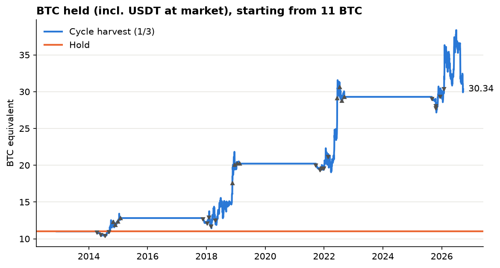

# BTC cycle harvest: study

Generated 2026-09-24 23:47 UTC · regenerate with `uv run rotation cycle-report`.

**Goal (Matt, 2026-09-24):** grow the BTC count. Sell at least a third of the stack near each
cycle top into USDT, then deploy it back into BTC near the bear-market bottom. No round trips.
Scored in BTC: a cycle multiple of 1.10x means 10% more BTC at the next halving than at this one.
Fees 0.2% per trade; tax reserved at 15% of each sale's gain (0% shown for comparison).

## The rule

**Sell (from day `window_start` to `window_end` after each halving):** a share of the target
(`clock_share`) is sold in 4 evenly spaced tranches; the rest of the target is sold on the first
weekly close below the 20-week average after a new all-time high inside the window.

**Buy:** start deploying the USDT in 4 monthly tranches once BTC has gone `start_days_since_ath`
days without a new high, or is `start_drawdown` below it, or MVRV < 1. Deploy everything left
540 days after the high, or at once if BTC makes a new all-time high (the bottom was missed).

## Honest test: every cycle scored with settings chosen without it

Sell a third:

| held_out_cycle   | trained_on                         | held_out_multiple   |   window_start_days |   window_end_days |   clock_share |   start_days_since_ath |   start_drawdown |
|:-----------------|:-----------------------------------|:--------------------|--------------------:|------------------:|--------------:|-----------------------:|-----------------:|
| 2012-11-28       | 2016-07-09, 2020-05-11             | 1.165x              |                 500 |               700 |             1 |                    360 |              0.8 |
| 2016-07-09       | 2012-11-28, 2020-05-11             | 1.013x              |                 400 |               700 |             1 |                    360 |              0.7 |
| 2020-05-11       | 2012-11-28, 2016-07-09             | 1.449x              |                 500 |               700 |             1 |                    360 |              0.8 |
| 2024-04-19       | 2012-11-28, 2016-07-09, 2020-05-11 | 1.036x              |                 500 |               700 |             1 |                    360 |              0.8 |

Sell half:

| held_out_cycle   | trained_on                         | held_out_multiple   |   window_start_days |   window_end_days |   clock_share |   start_days_since_ath |   start_drawdown |
|:-----------------|:-----------------------------------|:--------------------|--------------------:|------------------:|--------------:|-----------------------:|-----------------:|
| 2012-11-28       | 2016-07-09, 2020-05-11             | 1.248x              |                 500 |               700 |             1 |                    360 |              0.8 |
| 2016-07-09       | 2012-11-28, 2020-05-11             | 1.021x              |                 400 |               700 |             1 |                    360 |              0.7 |
| 2020-05-11       | 2012-11-28, 2016-07-09             | 1.677x              |                 500 |               700 |             1 |                    360 |              0.8 |
| 2024-04-19       | 2012-11-28, 2016-07-09, 2020-05-11 | 1.060x              |                 500 |               700 |             1 |                    360 |              0.8 |

The last row of each table is a true forward test: settings chosen on 2012-2020 only, then applied
to the 2024 cycle (still in progress: its USDT is valued at today's price).

**Robustness:** of all 243 setting combinations tested, 60% beat holding in
every complete cycle. The worst complete cycle across all combinations ranged from
0.99x to 1.25x.

## With today's settings (chosen on 2012-2020), from 11 BTC

Settings: window_start_days = 500, window_end_days = 700, clock_share = 1, start_days_since_ath = 360, start_drawdown = 0.8.

**Read these tables with care:** these settings were *picked because* they did best on
2012-2020, so the 2012, 2016 and 2020 rows below are in-sample and flatter than reality. The
honest numbers are the held-out table above. Only the 2024 row here is a genuine forward test.

Tax 15%:

| cycle      | complete   |   btc_start |   btc_end | multiple   |   usdt_left_at_end |
|:-----------|:-----------|------------:|----------:|:-----------|-------------------:|
| 2012-11-28 | True       |      11     |    12.819 | 1.165x     |        0           |
| 2016-07-09 | True       |      12.819 |    20.218 | 1.577x     |        0           |
| 2020-05-11 | True       |      20.218 |    29.296 | 1.449x     |        0           |
| 2024-04-19 | False      |      29.296 |    30.345 | 1.036x     |        1.53147e+06 |

Tax 0%:

| cycle      | complete   |   btc_start |   btc_end | multiple   |   usdt_left_at_end |
|:-----------|:-----------|------------:|----------:|:-----------|-------------------:|
| 2012-11-28 | True       |      11     |    13.76  | 1.251x     |        0           |
| 2016-07-09 | True       |      13.76  |    24.276 | 1.764x     |        0           |
| 2020-05-11 | True       |      24.276 |    38.981 | 1.606x     |        0           |
| 2024-04-19 | False      |      38.981 |    43.903 | 1.126x     |        2.33557e+06 |

Selling half instead of a third (tax 15%):

| cycle      | complete   |   btc_start |   btc_end | multiple   |   usdt_left_at_end |
|:-----------|:-----------|------------:|----------:|:-----------|-------------------:|
| 2012-11-28 | True       |      11     |    13.728 | 1.248x     |        0           |
| 2016-07-09 | True       |      13.728 |    25.634 | 1.867x     |        0           |
| 2020-05-11 | True       |      25.634 |    42.989 | 1.677x     |        0           |
| 2024-04-19 | False      |      42.989 |    45.559 | 1.060x     |        3.39301e+06 |

### Every trade (sell a third, tax 15%)

| date       | side   |   btc |    usd |    tax |     px | reason      |
|:-----------|:-------|------:|-------:|-------:|-------:|:------------|
| 2014-04-12 | sell   | 0.917 |    388 |     57 |    424 | clock_1     |
| 2014-06-01 | sell   | 0.917 |    576 |     85 |    630 | clock_2     |
| 2014-07-21 | sell   | 0.917 |    568 |     84 |    621 | clock_3     |
| 2014-09-09 | sell   | 0.917 |    433 |     63 |    474 | clock_4     |
| 2014-10-31 | buy    | 1.242 |    419 |      0 |    337 | tranche_1   |
| 2014-11-30 | buy    | 1.106 |    419 |      0 |    379 | tranche_2   |
| 2014-12-30 | buy    | 1.349 |    419 |      0 |    310 | tranche_3   |
| 2015-01-29 | buy    | 1.789 |    419 |      0 |    234 | tranche_4   |
| 2017-11-21 | sell   | 1.068 |   8627 |   1272 |   8092 | clock_1     |
| 2018-01-10 | sell   | 1.068 |  15638 |   2324 |  14669 | clock_2     |
| 2018-02-04 | sell   | 2.136 |  17591 |   2595 |   8251 | trend_break |
| 2018-03-01 | sell   | 1.068 |  11645 |   1725 |  10924 | clock_3     |
| 2018-04-20 | sell   | 1.068 |   9424 |   1391 |   8840 | clock_4     |
| 2018-11-19 | buy    | 2.792 |  13405 |      0 |   4792 | tranche_1   |
| 2018-12-19 | buy    | 3.618 |  13405 |      0 |   3698 | tranche_2   |
| 2019-01-18 | buy    | 3.706 |  13405 |      0 |   3609 | tranche_3   |
| 2019-02-17 | buy    | 3.693 |  13405 |      0 |   3623 | tranche_4   |
| 2021-09-23 | sell   | 1.685 |  75433 |  10634 |  44861 | clock_1     |
| 2021-11-12 | sell   | 1.685 | 107746 |  15481 |  64079 | clock_2     |
| 2021-12-05 | sell   | 3.37  | 165883 |  23520 |  49327 | trend_break |
| 2022-01-01 | sell   | 1.685 |  79970 |  11314 |  47560 | clock_3     |
| 2022-02-20 | sell   | 1.685 |  64823 |   9042 |  38552 | clock_4     |
| 2022-06-13 | buy    | 4.739 | 105966 |      0 |  22316 | tranche_1   |
| 2022-07-13 | buy    | 5.247 | 105966 |      0 |  20156 | tranche_2   |
| 2022-08-12 | buy    | 4.335 | 105966 |      0 |  24396 | tranche_3   |
| 2022-09-11 | buy    | 4.866 | 105966 |      0 |  21733 | tranche_4   |
| 2025-09-01 | sell   | 2.441 | 265553 |  34194 | 108992 | clock_1     |
| 2025-10-19 | sell   | 7.324 | 794570 | 102269 | 108707 | trend_break |
| 2025-10-21 | sell   | 2.441 | 264841 |  34087 | 108700 | clock_2     |
| 2025-12-10 | sell   | 2.441 | 224403 |  28021 |  92103 | clock_3     |
| 2026-01-29 | sell   | 2.441 | 205928 |  25250 |  84520 | clock_4     |

## Caveats

- **Four cycles.** Three complete, one in progress. That is enough to see a pattern, not to
  prove one. The halving clock worked for 2016, 2020 and 2024 tops (525-546 days after the
  halving) but the 2013 top came at 371 days: a cycle that breaks the pattern will hurt.
- **The rule is only as good as the next cycle resembling the last three.** The trend-break
  exit and the new-high redeploy are there so a broken pattern costs a slice of upside, not the
  stack.
- **Tax** depends on your cost basis and jurisdiction; this uses one flat rate on each sale's gain.
