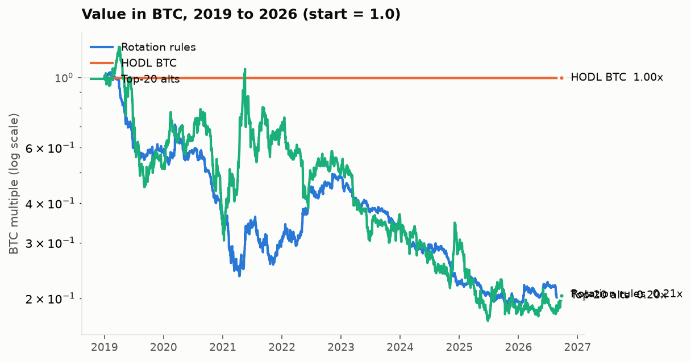
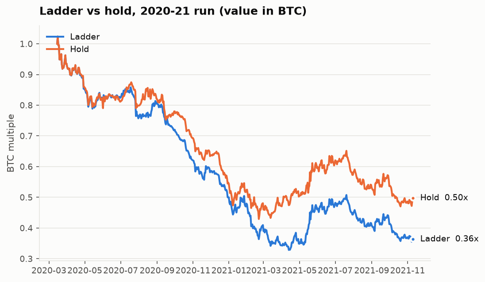
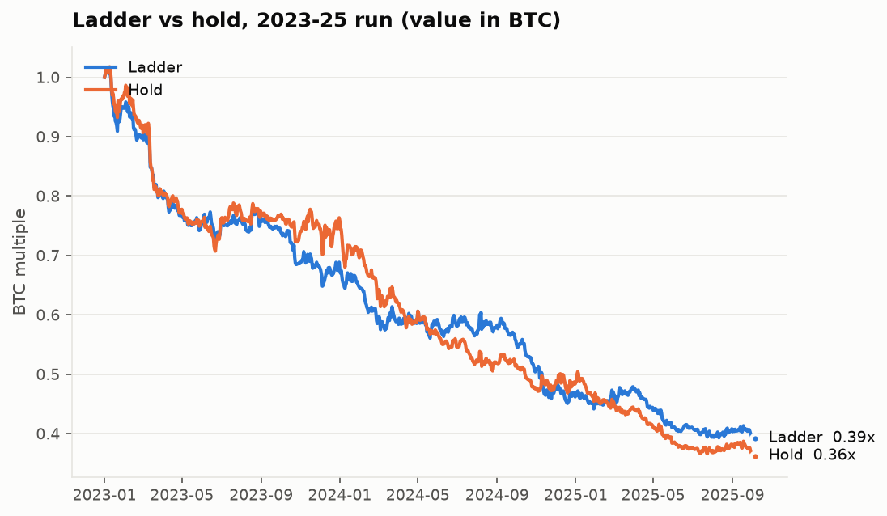
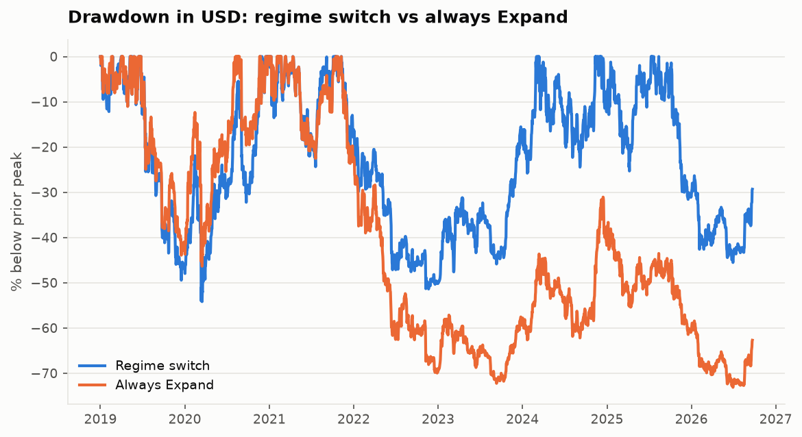
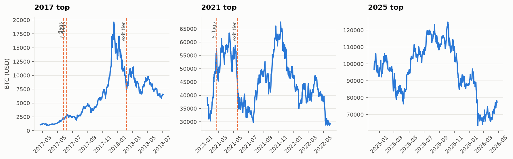

# Phase 0 backtest report

Generated 2026-09-24 21:57 UTC from config hash `cbac5c3017a51b88`
(rules v1). Regenerate: `uv run rotation report`.

**All results are measured in BTC**, net of the tax reserve (treated as owed). A BTC
multiple of 1.00x means "ended with as much BTC as it started with"; buying BTC on day one
and holding scores 0.996x after the purchase fee.

## Headline

| 2019-01-01 to 2026-09-22 | BTC multiple |
|---|---|
| **Rotation rules** | **0.21x** |
| HODL BTC | 1.00x |
| Top-20 alts (equal weight) | 0.20x |
| Top-100 alts (equal weight) | 0.09x |

| variant          | BTC multiple   | USD multiple   | Max drawdown (USD)   | Max drawdown (BTC)   |   Alt entries |   Fees (BTC) | Avg alt weight   |
|:-----------------|:---------------|:---------------|:---------------------|:---------------------|--------------:|-------------:|:-----------------|
| Rotation (rules) | 0.21x          | 5.08x          | 54%                  | 82%                  |           544 |         2.23 | 17%              |

## Q1. Profit ladder vs hold, in BTC

- **2020-21 run:** ladder 0.36x vs hold 0.50x in BTC (HODL BTC 1.00x, top-100 alts 2.09x).
- **2023-25 run:** ladder 0.39x vs hold 0.36x in BTC (HODL BTC 1.00x, top-100 alts 0.26x).

**2020-21 run**

| variant                 | BTC multiple   | USD multiple   | Max drawdown (USD)   | Max drawdown (BTC)   |   Alt entries |   Fees (BTC) | Avg alt weight   |
|:------------------------|:---------------|:---------------|:---------------------|:---------------------|--------------:|-------------:|:-----------------|
| Ladder (rules)          | 0.36x          | 4.98x          | 25%                  | 68%                  |            89 |         0.49 | 14%              |
| Hold (no profit-taking) | 0.50x          | 6.99x          | 28%                  | 58%                  |            60 |         0.41 | 19%              |

**2023-25 run**

| variant                 | BTC multiple   | USD multiple   | Max drawdown (USD)   | Max drawdown (BTC)   |   Alt entries |   Fees (BTC) | Avg alt weight   |
|:------------------------|:---------------|:---------------|:---------------------|:---------------------|--------------:|-------------:|:-----------------|
| Ladder (rules)          | 0.39x          | 3.21x          | 25%                  | 61%                  |           272 |         0.38 | 26%              |
| Hold (no profit-taking) | 0.36x          | 2.94x          | 37%                  | 65%                  |           232 |         0.29 | 30%              |

## Q2. Does the ALT/BTC 50D gate help?

| variant                   | BTC multiple   | USD multiple   | Max drawdown (USD)   | Max drawdown (BTC)   |   Alt entries |   Fees (BTC) | Avg alt weight   |
|:--------------------------|:---------------|:---------------|:---------------------|:---------------------|--------------:|-------------:|:-----------------|
| With ALT/BTC gate (rules) | 0.21x          | 5.08x          | 54%                  | 82%                  |           544 |         2.23 | 17%              |
| Without ALT/BTC gate      | 0.22x          | 5.58x          | 60%                  | 81%                  |           559 |         2.31 | 17%              |

## Q3. Does the BTC 200D regime switch cut drawdown?

Max drawdown in USD: regime switch 54%, always Expand
73%, always Accumulate 57%.

| variant               | BTC multiple   | USD multiple   | Max drawdown (USD)   | Max drawdown (BTC)   |   Alt entries |   Fees (BTC) | Avg alt weight   |
|:----------------------|:---------------|:---------------|:---------------------|:---------------------|--------------:|-------------:|:-----------------|
| Regime switch (rules) | 0.21x          | 5.08x          | 54%                  | 82%                  |           544 |         2.23 | 17%              |
| Always Expand         | 0.08x          | 1.89x          | 73%                  | 93%                  |           884 |         2.84 | 31%              |
| Always Accumulate     | 0.37x          | 9.63x          | 57%                  | 69%                  |           543 |         2.35 | 17%              |

## Q4. Would the flags + backstop have exited near the tops?

"vs top" is BTC's price when that tier first fired, relative to the cycle high
(negative = below the top). Tier 1 = 3 flags (sell 25% of alts), tier 2 = 5 flags
(sell 50% more + 20% of the Vault), tier 3 = 6 flags or the 20-week backstop (exit alts +
another 20% of the Vault).

|   cycle | btc_top_date   | btc_top_usd   |   max_flags | tier1_date   | tier1_vs_top   |   tier1_days_from_top | tier2_date   | tier2_vs_top   |   tier2_days_from_top | tier3_date   | tier3_vs_top   |   tier3_days_from_top | backstop_date   | backstop_vs_top   | flags_missing_data             |
|--------:|:---------------|:--------------|------------:|:-------------|:---------------|----------------------:|:-------------|:---------------|----------------------:|:-------------|:---------------|----------------------:|:----------------|:------------------|:-------------------------------|
|    2017 | 2017-12-16     | $19,641       |           5 | 2017-05-24   | -88%           |                  -206 | 2017-06-05   | -86%           |                  -194 | 2018-02-04   | -58%           |                    50 | 2018-02-04      | -58%              | funding                        |
|    2021 | 2021-11-08     | $67,542       |           5 | 2021-01-02   | -53%           |                  -310 | 2021-02-21   | -15%           |                  -260 | 2021-05-16   | -32%           |                  -176 | 2021-05-16      | -32%              |                                |
|    2025 | 2025-10-06     | $124,824      |           2 |              |                |                   nan |              |                |                   nan |              |                |                   nan |                 |                   | altseason;funding;memes;mvrv_z |

## Q5. Score threshold: enter at 3+ vs 4+ only

| variant             | BTC multiple   | USD multiple   | Max drawdown (USD)   | Max drawdown (BTC)   |   Alt entries |   Fees (BTC) | Avg alt weight   |
|:--------------------|:---------------|:---------------|:---------------------|:---------------------|--------------:|-------------:|:-----------------|
| Enter at 3+ (rules) | 0.21x          | 5.08x          | 54%                  | 82%                  |           544 |         2.23 | 17%              |
| Enter at 4+ only    | 0.21x          | 5.08x          | 54%                  | 82%                  |           544 |         2.23 | 17%              |

Walk-forward (train 730 days, test
180 days, pick the variant that did better in training):
chooser 0.49x, always 3+ 0.49x, always 4+ 0.49x over 11 six-month test windows.

## Open question: Vault rebalancing

The program doc gives Vault targets per regime but does not say whether the Vault is
ever *sold* to get back to target. The two readings behave very differently:

| variant           | BTC multiple   | USD multiple   | Max drawdown (USD)   | Max drawdown (BTC)   |   Alt entries |   Fees (BTC) | Avg alt weight   |
|:------------------|:---------------|:---------------|:---------------------|:---------------------|--------------:|-------------:|:-----------------|
| Two-way Vault     | 0.21x          | 5.08x          | 54%                  | 82%                  |           544 |         2.23 | 17%              |
| Top-up-only Vault | 0.81x          | 18.88x         | 62%                  | 43%                  |            43 |         0.34 | 1%               |

## Data quality and what is missing

| Input | Status in this backtest |
|---|---|
| Point-in-time top 100, incl. dead coins | Full (CoinGecko Analyst backfill, 57,781 coins) |
| Prices | CoinMetrics reference rate for BTC (all dates) and 88 alts (pre-2019); CoinGecko otherwise |
| Funding | Binance perps from 2020-01; 318 coins mapped and price-validated |
| Open interest | Binance, from n/a; before that "not crowded" is judged on funding alone |
| Token unlocks, exchange count, catalyst | **Not available historically**: gates pass by default (live-only) |
| Flags without data | listed per cycle in the Q4 table (`flags_missing_data`) |
| 2017-18 alt prices | CoinGecko-only for coins CoinMetrics doesn't cover: noisy (BTC's CoinGecko series was off by up to 21% on the worst days) |

Three cycles is a small sample. These results show the direction and size of each rule's
effect on this history; they cannot prove statistical significance.
