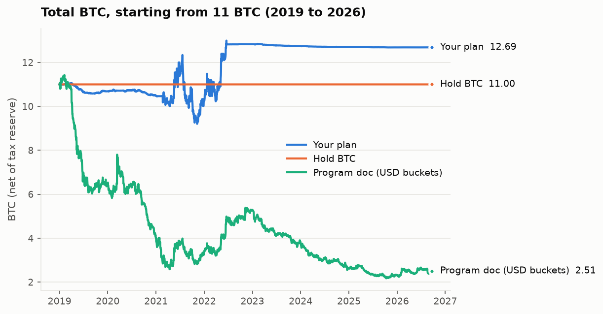
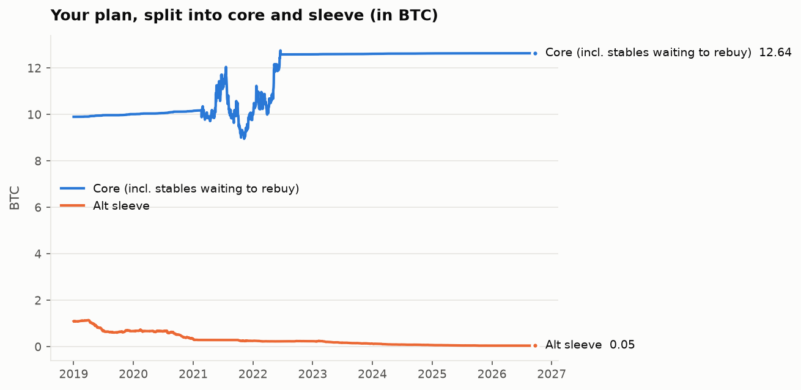

# Phase 0 backtest report

Generated 2026-09-24 22:46 UTC · config hash `d1421cdb56a77aaf` (rules
v1) · regenerate with `uv run rotation report`.

**Everything is measured in BTC**, net of the tax reserve (treated as owed). The plan
tested is Matt's (2026-09-24): **11 BTC, 90% kept as a
BTC core that is never sold to rebalance, 10% as an alt sleeve that
runs every rule.** Idle sleeve money is held as BTC. Sleeve losses are never topped up.

## Headline: 2019-01-01 to 2026-09-22

| variant                                      | 11 BTC became   | vs start   | USD multiple   | Sleeve at end   | Sleeve worst drop   | Worst drop (BTC)   | Worst drop (USD)   |   Alt buys |   Fees (BTC) |
|:---------------------------------------------|:----------------|:-----------|:---------------|:----------------|:--------------------|:-------------------|:-------------------|-----------:|-------------:|
| Your plan: BTC core + 10% alt sleeve         | 12.69 BTC       | +15%       | 26.8x          | 0.05 BTC        | 96%                 | 25%                | 65%                |        690 |         0.12 |
| Core only, with the cycle-top exit (no alts) | 13.59 BTC       | +24%       | 28.6x          | 0.00 BTC        |                     | 26%                | 65%                |          0 |         0.04 |
| Just hold the BTC                            | 11.00 BTC       | +0%        | 22.6x          | 0.00 BTC        |                     | 0%                 | 77%                |          0 |         0    |
| Program doc as written: USD buckets, two-way | 2.51 BTC        | -77%       | 5.8x           |                 |                     | 81%                | 54%                |        563 |         2.29 |
| Program doc: USD buckets, Vault top-up only  | 8.94 BTC        | -19%       | 18.9x          |                 |                     | 43%                | 62%                |         43 |         0.34 |

**Where the plan's BTC came from**

| Source | BTC |
|---|---|
| Start | 11.00 |
| Cycle-top exit on the core (rule 10): sold 3.66 BTC near the highs, rebought 6.06 BTC after a 50%+ crash | +2.40 |
| Alt profits routed into the core (rule 5) | +0.34 |
| Alt sleeve itself: 1.10 BTC at the start, 0.05 BTC at the end | -1.05 |
| Tax reserve and other | +0.00 |
| **End** | **12.69** |

Against the same core with no alts, the alt sleeve changed the result by
**-0.90 BTC**. Against plain holding, the cycle-top exit changed it by
**+2.59 BTC**.

**The same designs in the two alt runs** (11 BTC at the start; alt baskets are
equal-weight and point-in-time, shown as a BTC multiple)

| Run | Your plan | Core only | Hold BTC | Program doc (USD) | Top-20 alts | Top-100 alts |
|---|---|---|---|---|---|---|
| 2020-21 run | 9.49 | 9.80 | 11.00 | 4.00 | 0.96x | 2.09x |
| 2023-25 run | 10.34 | 11.00 | 11.00 | 3.92 | 0.41x | 0.26x |

Run windows end at the cycle top, so BTC the core moved to stables near that top is still
waiting for the rebuy and counts at the top's price.

**Context: alts vs BTC.** An equal-weight basket of the top-20 alts ended 2019-26 at
0.20x its starting BTC value; the top-100 at
0.09x. Alts beat BTC in 2017 and, broadly, in 2020-21, and lost to it
in every other stretch tested.

## Q1. Profit ladder vs hold

**2020-21 run**

| variant                 | 11 BTC became   | vs start   | USD multiple   | Sleeve at end   | Sleeve worst drop   | Worst drop (BTC)   | Worst drop (USD)   |   Alt buys |   Fees (BTC) |
|:------------------------|:----------------|:-----------|:---------------|:----------------|:--------------------|:-------------------|:-------------------|-----------:|-------------:|
| Ladder (rules)          | 9.49 BTC        | -14%       | 10.9x          | 0.41 BTC        | 64%                 | 25%                | 40%                |         96 |         0.05 |
| Hold (no profit-taking) | 9.52 BTC        | -13%       | 11.0x          | 0.44 BTC        | 61%                 | 25%                | 39%                |         78 |         0.05 |

**2023-25 run**

| variant                 | 11 BTC became   | vs start   | USD multiple   | Sleeve at end   | Sleeve worst drop   | Worst drop (BTC)   | Worst drop (USD)   |   Alt buys |   Fees (BTC) |
|:------------------------|:----------------|:-----------|:---------------|:----------------|:--------------------|:-------------------|:-------------------|-----------:|-------------:|
| Ladder (rules)          | 10.34 BTC       | -6%        | 7.1x           | 0.23 BTC        | 80%                 | 7%                 | 28%                |        354 |         0.08 |
| Hold (no profit-taking) | 10.42 BTC       | -5%        | 7.1x           | 0.28 BTC        | 77%                 | 6%                 | 28%                |        322 |         0.07 |

## Q2. Does the ALT/BTC 50D gate help?

| variant                   | 11 BTC became   | vs start   | USD multiple   | Sleeve at end   | Sleeve worst drop   | Worst drop (BTC)   | Worst drop (USD)   |   Alt buys |   Fees (BTC) |
|:--------------------------|:----------------|:-----------|:---------------|:----------------|:--------------------|:-------------------|:-------------------|-----------:|-------------:|
| With ALT/BTC gate (rules) | 12.69 BTC       | +15%       | 26.8x          | 0.05 BTC        | 96%                 | 25%                | 65%                |        690 |         0.12 |
| Without ALT/BTC gate      | 12.72 BTC       | +16%       | 26.9x          | 0.06 BTC        | 95%                 | 25%                | 65%                |        788 |         0.13 |

## Q3. Does the BTC 200D regime switch cut drawdown?

In your plan the regime only steers the alt sleeve, so the drawdown that matters is the
sleeve's.

| variant               | 11 BTC became   | vs start   | USD multiple   | Sleeve at end   | Sleeve worst drop   | Worst drop (BTC)   | Worst drop (USD)   |   Alt buys |   Fees (BTC) |
|:----------------------|:----------------|:-----------|:---------------|:----------------|:--------------------|:-------------------|:-------------------|-----------:|-------------:|
| Regime switch (rules) | 12.69 BTC       | +15%       | 26.8x          | 0.05 BTC        | 96%                 | 25%                | 65%                |        690 |         0.12 |
| Always Expand         | 12.78 BTC       | +16%       | 27.0x          | 0.02 BTC        | 98%                 | 25%                | 65%                |        921 |         0.13 |
| Always Accumulate     | 12.78 BTC       | +16%       | 27.0x          | 0.04 BTC        | 97%                 | 25%                | 65%                |        888 |         0.13 |

## Q4. Would the flags + backstop have exited near the tops?

"vs top" is BTC's price when that tier first fired, relative to the cycle high. Tier 1 = 3
flags (sell 25% of alts); tier 2 = 5 flags (sell 50% more + 20% of the core to stables);
tier 3 = 6 flags or the 20-week backstop (exit alts + another 20% of the core).

| cycle      | btc_top_date   | btc_top_usd   |   max_flags | tier1_date   | tier1_vs_top   | tier2_date   | tier2_vs_top   | tier3_date   | tier3_vs_top   | backstop_date   | backstop_vs_top   | flags_missing_data   |
|:-----------|:---------------|:--------------|------------:|:-------------|:---------------|:-------------|:---------------|:-------------|:---------------|:----------------|:------------------|:---------------------|
| 2017       | 2017-12-16     | $19,641       |           5 | 2017-05-24   | -88%           | 2017-06-05   | -86%           | 2018-02-04   | -58%           | 2018-02-04      | -58%              | funding              |
| 2021 (Apr) | 2021-04-13     | $63,446       |           5 | 2021-01-02   | -50%           | 2021-02-21   | -9%            | 2021-05-16   | -27%           | 2021-05-16      | -27%              |                      |
| 2021 (Nov) | 2021-11-08     | $67,542       |           5 | 2021-01-02   | -53%           | 2021-02-21   | -15%           | 2021-05-16   | -32%           | 2021-05-16      | -32%              |                      |
| 2025       | 2025-10-06     | $124,824      |           2 |              |                |              |                |              |                |                 |                   |                      |

## Q5. Score threshold: enter at 3+ vs 4+ only

| variant             | 11 BTC became   | vs start   | USD multiple   | Sleeve at end   | Sleeve worst drop   | Worst drop (BTC)   | Worst drop (USD)   |   Alt buys |   Fees (BTC) |
|:--------------------|:----------------|:-----------|:---------------|:----------------|:--------------------|:-------------------|:-------------------|-----------:|-------------:|
| Enter at 3+ (rules) | 12.69 BTC       | +15%       | 26.8x          | 0.05 BTC        | 96%                 | 25%                | 65%                |        690 |         0.12 |
| Enter at 4+ only    | 12.81 BTC       | +16%       | 27.1x          | 0.11 BTC        | 91%                 | 25%                | 65%                |        394 |         0.13 |

Walk-forward (train 730 days, test
180 days, pick whichever did better in training): chooser 0.923x, always 3+ 0.915x, always 4+ 0.928x (total-portfolio BTC multiple, chained over 11 six-month test windows).

## Data quality

| Input | Status |
|---|---|
| Point-in-time top 100, incl. dead coins | Full: CoinGecko Analyst backfill, 57,781 coins |
| Prices | CoinMetrics reference rate for BTC (all dates) and 88 alts before 2019; CoinGecko otherwise |
| Funding | Binance perps from 2020-01; 318 coins mapped and price-validated |
| Open interest | Binance from 2021-12-01; before that "not crowded" uses funding alone |
| Known perp gaps | TON before 2026-07 (ticker rebrand), MKR, FTM, BTT (migrations): no funding/OI |
| Token unlocks, exchange count, catalyst | Not available historically: those gates pass by default |
| Flags without data | per cycle in the Q4 table (`flags_missing_data`) |
| 2017-18 alt prices | CoinGecko-only where CoinMetrics has no series: noisy |

Three cycles is a small sample. These results show the direction and size of each rule's
effect on this history; they cannot prove statistical significance.
